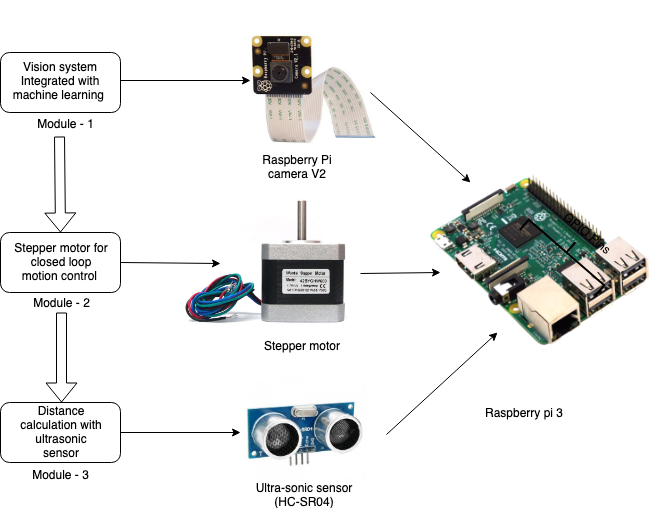
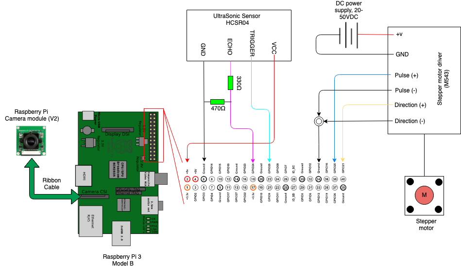

# Industrial-masterThesis
                              Vision and Sensor-based security system for autonomous robot
To implement all the functionality together the system with three main modules as shown below was proposed.
The main advantage of the system was to detect the humans in the time to time changing environment and sensing their distance accurately up to the range of 4 meters without any predetermined position for the system.
Those three main modules include the Raspberry Pi camera V2, stepper motor and an ultrasonic sensor (HCSR-04).
These individual modules functionality and the configuration was discussed in the following topics.
These three modules work serially when any humans where detected in the surveillance region to estimate the distance of the human form the system.

Each module shown above was responsible for their individual tasks controlled by the CPU unit – Raspberry Pi – 3(B).
The serial communication of each module with the raspberry pi is established using the general-purpose input/output interface as shown in the wiring configuration as shown in the below diagram.
To complete the whole process right from extracting the human position to distance calculation the whole system has to complete their functional loop once.
For this task, the modules work concurrently in the real-time environment based on the data obtained by each of them to finish the task of distance calculation of the detected human as a final result.

